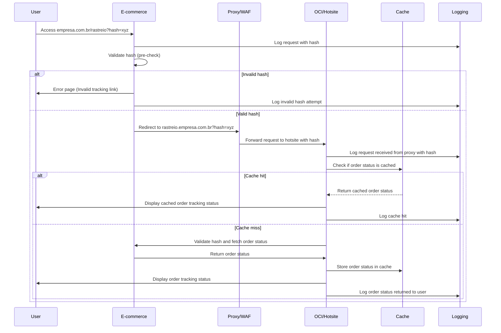

Proposta de Solução: Hotsite de Rastreamento de Pedidos Integrado
=================================================================

Objetivo
--------

Melhorar a experiência do cliente ao oferecer uma solução eficiente e acessível para o rastreamento em tempo real de seus pedidos. O hotsite será integrado à infraestrutura de e-commerce existente, utilizando a Oracle Cloud Infrastructure (OCI) para garantir escalabilidade, segurança e disponibilidade.

1\. Arquitetura de Integração e Comunicação
-------------------------------------------

### Pergunta: Como será a comunicação entre o hotsite na Oracle OCI e o e-commerce on-premises?

*   **Solução:** Implementar APIs RESTful para comunicação entre os dois ambientes.
*   **Mitigação:** Utilizar HTTPS, autenticação via JWT, caching, e retries automáticos para falhas.

### Pergunta: O hotsite precisará consultar operadores logísticos diretamente?

*   **Solução:** Implementar endpoints de operadores logísticos e utilizar webhooks para atualizações.
*   **Mitigação:** Definir um padrão de API, validar dados recebidos e garantir segurança.

2\. Persistência de Dados e Sincronização
-----------------------------------------

### Pergunta: Onde os dados de rastreamento serão armazenados?

*   **Solução:** Manter os dados no hotsite hospedado na OCI, com sincronização periódica.
*   **Mitigação:** Implementar replicação e backups para garantir resiliência.

### Pergunta: Como garantir a integridade e consistência dos dados?

*   **Solução:** Sincronização em tempo real entre ambientes, utilizando filas de mensagens.
*   **Mitigação:** Monitoramento constante das filas de mensagens para evitar inconsistências.

3\. Segurança
-------------

### Pergunta: Como garantir a segurança das APIs?

*   **Solução:** Implementar autenticação OAuth 2.0/JWT e comunicação via HTTPS.
*   **Mitigação:** Realizar auditorias de segurança e monitorar o tráfego para detectar anomalias.

### Pergunta: Como proteger os dados do cliente e do pedido?

*   **Solução:** Criptografia em trânsito e em repouso, controle de acesso adequado.
*   **Mitigação:** Rotação de chaves de criptografia e auditoria de acesso aos dados.

4\. Escalabilidade e Desempenho
-------------------------------

### Pergunta: Como garantir a escalabilidade do hotsite?

*   **Solução:** Utilizar autoescalabilidade na OCI, com Kubernetes e load balancing.
*   **Mitigação:** Realizar testes de carga e definir limites de autoscaling.

### Pergunta: Como minimizar o impacto no tempo de resposta ao buscar dados de múltiplas fontes?

*   **Solução:** Implementar caching eficiente (Redis) no hotsite.
*   **Mitigação:** Definir políticas de atualização de cache para evitar dados obsoletos.

5\. Disponibilidade e Monitoramento
-----------------------------------

### Pergunta: Como garantir alta disponibilidade do hotsite?

*   **Solução:** Implementar redundância em múltiplas regiões da OCI.
*   **Mitigação:** Configurar autoscaling e failover automáticos para manter o serviço ativo.

### Pergunta: Como realizar o monitoramento de erros e performance?

*   **Solução:** Usar Oracle Cloud Monitoring para coletar métricas e logs.
*   **Mitigação:** Definir alertas automáticos e implementar equipe de resposta rápida.

6\. Gerenciamento de Atualizações
---------------------------------

### Pergunta: Como realizar atualizações sem impactar o cliente?

*   **Solução:** Adotar blue/green deployment ou canary releases.
*   **Mitigação:** Realizar testes automatizados de regressão antes de cada atualização.

7\. Operações de Faturamento e Integração com Sistemas Legados
--------------------------------------------------------------

### Pergunta: Como garantir o envio da URL de rastreamento após o faturamento?

*   **Solução:** Integrar o faturamento com o hotsite usando filas de mensagens.
*   **Mitigação:** Implementar sistema de logging e retries para evitar falhas no envio de URLs.

8\. Desafios e Soluções de Integração entre o E-commerce e OCI
--------------------------------------------------------------

### Estrutura de URL e Redirecionamento

*   **Solução:** Usar proxy reverso ou configurar subdomínios para redirecionar o tráfego para a OCI sem impactar a experiência do usuário.
*   **Mitigação:** Manter consistência de URL e utilizar DNS com WAF e Load Balancer na OCI.

### Passagem pelo WAF e Load Balancer

*   **Solução:** Configurar o WAF para inspecionar tráfego e proteger contra ataques, enquanto o Load Balancer distribui as requisições.
*   **Mitigação:** Utilizar HTTPS com certificados gerenciados e monitoramento de segurança.

### 8.1\. **Estrutura de URL e Redirecionamento**

A URL do e-commerce será do tipo `empresa.com.br/rastreio?hash_do_pedido_do_cliente`, que deve redirecionar para o hotsite hospedado na OCI, enquanto mantém a consistência do domínio e oferece uma experiência transparente ao usuário.

#### Solução Proposta:

1.  **Configuração de Reverse Proxy**:
    *   O domínio principal `empresa.com.br` pode ser configurado para usar um **reverse proxy** que repasse as requisições para o hotsite na OCI sem que o cliente perceba a troca de servidor.
    *   O **reverse proxy** pode ser configurado no próprio servidor onde o e-commerce on-premises está hospedado, ou você pode utilizar serviços externos (como **Cloudflare**, **F5** ou **NGINX** em modo proxy).
    *   Quando o usuário acessar `empresa.com.br/rastreio?hash_do_pedido_do_cliente`, o reverse proxy será responsável por pegar essa requisição e encaminhá-la para o hotsite em `oci-hotsite.com.br`, mantendo o domínio original na barra de navegação do usuário.
2.  **DNS e Subdomínios**:
    *   Outra abordagem seria configurar um **subdomínio** dedicado para o hotsite no OCI, como `rastreio.empresa.com.br`. O DNS da empresa direcionaria este subdomínio diretamente para a infraestrutura do hotsite no Oracle Cloud (via **Load Balancer** ou ingress controller do Kubernetes).
        
    *   Isso seria gerenciado diretamente por DNS, e o cliente ao acessar `rastreio.empresa.com.br` seria redirecionado para o ambiente do hotsite na OCI sem notar a diferença.
        
    
    > **Exemplo**:
    > *   Usuário acessa: `empresa.com.br/rastreio?hash_do_pedido_do_cliente`
    > *   O e-commerce encaminha para: `rastreio.empresa.com.br?hash_do_pedido_do_cliente`
    > *   O subdomínio `rastreio.empresa.com.br` está configurado para resolver via DNS o serviço no OCI, passando pelo WAF e Load Balancer.
    
3.  **Uso de WAF e Load Balancer**:
    *   **Web Application Firewall (WAF)** pode ser utilizado para proteger o tráfego direcionado ao hotsite. O WAF vai inspecionar e filtrar o tráfego antes de ser entregue ao hotsite no Kubernetes (OKE).
    *   O **Load Balancer** da OCI garantirá a distribuição do tráfego para os diferentes pods ou instâncias do hotsite dentro do Kubernetes, otimizando a escalabilidade e resiliência.
4.  **Controle de Sessões e Redirecionamento**:
    *   Ao realizar a integração entre o e-commerce e o hotsite, você precisará lidar com o redirecionamento do hash do pedido ou token de autenticação (passado como query string `?hash_do_pedido_do_cliente`). Este token pode ser validado tanto pelo e-commerce quanto pelo hotsite para garantir que a solicitação pertence a um pedido válido.
    *   O redirecionamento entre as URLs precisa ser feito com segurança, preservando os parâmetros essenciais (hash do pedido), para que o hotsite consiga recuperar o estado correto do pedido e exibir as informações de rastreamento.

### 8.2\. **Como Passar Pelo WAF e Load Balancer**

Se o hotsite está hospedado no OCI, é recomendável usar um **Web Application Firewall (WAF)** para proteger a aplicação contra ataques (como DDoS ou injeções maliciosas). Isso envolve:
1.  **Configuração do WAF**:
    *   No OCI, você pode configurar o **Oracle Cloud WAF** para proteger o hotsite. Ele inspeciona o tráfego HTTP/S e bloqueia acessos maliciosos antes que alcancem o Kubernetes no OKE.
    *   O WAF pode ser configurado para validar os headers e o payload do tráfego, permitindo apenas requisições legítimas.
2.  **Load Balancer**:
    *   O WAF pode ser configurado para rotear o tráfego para um **Oracle Load Balancer**. O Load Balancer distribuirá o tráfego para os diferentes pods da aplicação PHP rodando no Kubernetes (OKE).
    *   O Load Balancer também pode gerenciar **certificados SSL** para garantir que toda a comunicação com o hotsite seja segura (HTTPS). Isso permite que as requisições do cliente sejam seguras do início ao fim.
3.  **Segurança na Comunicação**:
    *   Se houver dados sensíveis sendo trocados (ex: hash do pedido, token de autenticação), utilize **criptografia de ponta a ponta** entre o cliente e o servidor.
    *   O WAF e o Load Balancer também ajudarão a mitigar ataques como injeções SQL, cross-site scripting (XSS), entre outros.

### 8.3\. **Proposta de Solução Detalhada**

1.  **Backend de Redirecionamento:**
    *   Implementar um endpoint no e-commerce on-premises (ex: `empresa.com.br/rastreio`) que será responsável por validar a requisição e redirecionar o usuário para o hotsite com o hash do pedido anexado à URL.
    *   Esse backend também pode verificar a validade do pedido e encaminhar o usuário para a interface de rastreamento correta.
2.  **Camada de Proxy ou Subdomínio:**
    *   **Proxy Reverso** ou **Subdomínio** configurado no e-commerce ou DNS para que o usuário continue com a experiência unificada em `empresa.com.br`. O proxy, neste caso, faz o forwarding de requisições para o hotsite hospedado na OCI.
3.  **Segurança e Autenticação:**
    *   Utilizar tokens JWT ou outra forma de autenticação segura para garantir que o hash do pedido não seja manipulado ou usado por pessoas não autorizadas.
    *   Configurar o **WAF** para proteger o hotsite de acessos maliciosos, e fazer o roteamento seguro para o Kubernetes usando o **Load Balancer** da OCI.
4.  **Frontend Responsivo e Otimizado:**
    *   O frontend do hotsite, hospedado no OCI, pode ser feito em PHP integrado com um framework frontend moderno (ex: React ou Vue.js) para melhorar a experiência do usuário. Este frontend será acessado via uma URL amigável, que pode ser gerada dinamicamente pelo e-commerce.

### 8.4\. **Mitigação de Possíveis Problemas**

1.  **Latência**: Se o e-commerce e o hotsite estão em infraestruturas diferentes (on-premises e OCI), certifique-se de que o tempo de resposta entre os servidores seja otimizado. Use **caching** de dados temporários para evitar consultas repetitivas.
    
2.  **Falhas na Integração**: Use ferramentas de monitoramento (como **Oracle Cloud Monitoring** ou **Prometheus** no Kubernetes) para identificar falhas na comunicação ou latência entre o e-commerce e o hotsite. Configure mecanismos de retries para consultas API.
    
3.  **Experiência Consistente**: Certifique-se de que o design visual do hotsite seja alinhado com o e-commerce para que o usuário tenha uma experiência unificada, independentemente da origem da requisição.
    
4.  **Segurança dos Dados**: Todos os dados sensíveis devem ser transmitidos de forma segura, com validação dos tokens de autenticação no hotsite para evitar que alguém acesse informações indevidas.Para esclarecer esses pontos sobre a integração entre o **hotsite** hospedado no Oracle Cloud Infrastructure (OCI) e o **e-commerce** com domínio próprio, segue uma visão detalhada de como essa estrutura pode ser configurada, abordando a parte de redirecionamento, WAF (Web Application Firewall), e integração do frontend:

